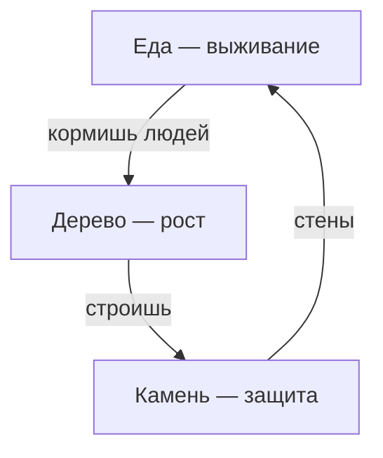

# Развитие termhold — идеи и баланс

Ориентир по дальнейшему развитию игры: механики, этапы, баланс.

---

## Диагноз текущей версии

| Есть | Нет |
|------|-----|
| 3 ресурса | расход за день |
| 1 действие за ход | последствий (проигрыш/победа) |
| лог событий | зданий, людей, случайных событий |
| дни считаются | ограничения на действия |

Игра пока **бесконечный фарм** — балансировать нечего, пока не появится «цена хода» и «цена бездействия».

---

## Этапы развития (по порядку сложности)

### Этап 1 — «Выживание» (1–2 вечера)

Добавь **население** и **ежедневный расход еды**:

```text
каждый tick:
  food -= population
  если food == 0 → голод, population -= 1, лог
  если population == 0 → game over
```

Действия игрока — единственный способ не умереть. Сразу появляется вопрос: «сегодня добываю еду или строю?»

### Этап 2 — «Строительство»

Здания как **разовая покупка** + **пассивный эффект**:

| Здание | Стоимость | Эффект |
|--------|-----------|--------|
| Хижина | 10 wood | +1 к max population |
| Склад | 15 wood, 5 stone | меньше порча еды (позже) |
| Каменоломня | 20 stone | +1 stone/день автоматически |

Команды: `b` → меню построек, или `1/2/3` для быстрого выбора.

### Этап 3 — «Мир»

Случайные события в `tick` (у тебя уже есть `rand` в зависимостях):

- «Нашли руду» → +stone
- «Наступила зима» → +2 к расходу food на 3 дня
- «Набег» → нужно stone для стены, иначе −wood

События — главный источник **истории** в логах.

### Этап 4 — «Цель»

Победа/поражение дают смысл сессии:

- **Выжить 30 дней** — простая цель
- **Построить крепость** (стена + башня + N населения)
- **Поражение**: population = 0 или 3 дня подряд без еды

---

## Идеи механик под текущую архитектуру

### 1. Одно действие за день — осознанный выбор

Оставь как есть, но сделай действия **несимметричными**:

```text
w → +3 wood,  −1 food (работа в лесу утомляет / нужен провиант)
s → +1 stone, долго (редкий ресурс)
f → +4 food,  только летом / с шансом неудачи
```

Игрок выбирает не «что прибавить», а **чем пожертвовать**.

### 2. Энергия / рабочие руки

```rust
population: usize,
workers_available: usize,  // = population - assigned_to_buildings
```

Каждое действие тратит 1 рабочего. Если людей мало — один сбор в день, если много — можно ввести «приказы на несколько дней вперёд» (позже).

### 3. Сезоны (каждые 7 дней)

```text
день % 7:
  0-4 весна/лето — food ×1.5 от команды f
  5-6 зима       — food ×0.5, расход ×1.5
```

Простая формула, сильный ритм: к зиме нужно накопить запас.

### 4. Деградация запасов (мягкое давление)

```text
если food > storage_cap:
  excess = food - cap
  food -= excess / 2   // часть портится
```

Заставляет строить склады, а не бесконечно копить.

### 5. Меню вместо одной клавиши

```text
m — меню построек
i — инвентарь / статус
? — справка
```

Терминальная игра живёт **информацией в логе** — пиши туда причину отказа: «Not enough wood (need 10, have 7)».

---

## Как балансировать: простая формула

Начни с **таблицы потока** (in/out за день):

```text
Доход с действия f:  +4 food / день (если игрок жмёт f)
Расход:              -2 food / день (population = 2)
Чистый баланс:       +2 если только еда, 0 если чередуешь
```

Правила баланса для такой игры:

1. **Стартовый запас** — на 5–10 дней без действий (сейчас 100 food при расходе 0 — слишком щедро; при pop=5 и −2/день хватит на 50 дней).
2. **Дефицит появляется к дню 7–10**, если игрок тупит.
3. **Кризис к дню 15–20**, если не строил и не планировал.
4. Каждое здание окупается за **N дней** — игрок должен это почувствовать в логе.

Пример стартовых чисел для pop=3, расход 1 food/чел/день:

| Параметр | Значение | Зачем |
|----------|----------|-------|
| food старт | 15 | 5 дней запаса |
| wood | 20 | 2 хижины сразу не купить |
| stone | 10 | камень ценнее дерева |
| Gather food | +5 | один день кормит колонию |
| Gather wood | +3 | хватает почти на хижину за 4 дня |

Подкручивай **один параметр за раз** и играй 10 минут — так проще, чем менять всё сразу.

---

## Баланс действий: треугольник



- **Еда** — срочная (без неё проигрыш)
- **Дерево** — среднесрочная (население, здания)
- **Камень** — долгосрочная (события, оборона)

Если одна клавиша всегда выгоднее — игрок перестанет выбирать. Сейчас `f` (+2) и `w` (+2) равны — разведи их по роли.

---

## Архитектура под рост (чтобы не упереться снова)

Когда механик станет больше:

```text
game.rs      — состояние, tick, apply_action
actions.rs   — enum Action + can_afford / apply
buildings.rs — BuildingKind, costs, effects
events.rs    — random events на tick
ui.rs        — только render + parse input
```

`process_command` превратится в:

```rust
if game.can_do(&action) {
    game.apply(action);
} else {
    game.log("Not enough resources.");
}
```

Балансные константы — в одном месте (`const` или `struct BalanceConfig`), не размазаны по `match`.

---

## Следующий шаг (минимальный скачок «из песочницы в игру»)

1. `population: 3`
2. В `tick`: `food -= population`, лог при нехватке
3. `GatherFood` даёт +5, остальное без изменений
4. Проигрыш при `population == 0`
5. Победа при `world.days >= 30`

Это ~30 строк, но уже есть **напряжение, цель и смысл логов**.
